# 图形学大作业-系统使用说明书

171860540 杨溢

#### 1 开发环境、编译环境、程序运行说明

本程序在windows 10 1903（版本号18362.535），PyCharm 2019.1.3 (Professional Edition)
Build #PY-191.7479.30环境下开发，使用Python 3.7.3 (default, Mar 27 2019, 17:13:21) [MSC v.1915 64 bit (AMD64)] :: Anaconda, Inc. on win32编译。

程序分为命令行界面和图形界面两部分。分别由main_cli.py和main.py使用pyinstaller打包为main_cli.exe和main_gui.exe，选项分别为为pyinstaller -F -w main_cli.py和pyinstaller -F -w main.py。使用图形界面时，双击main_gui.exe即可。由于使用pyinstaller -F打包，因此打开较慢。使用命令行界面时，

#### 2 系统功能说明

##### 2.1 命令行界面

接受两个参数， 第一个参数为指令文件的绝对路径或相对路径，第二个参数为画布保存位置的绝对路径。实现的功能包括：重置画布、保存画布、设置画笔颜色、绘制线段、绘制多边形、绘制椭圆、绘制曲线、对图元平移、对图元旋转、对图元缩放、对线段裁剪。指令的格式与作业要求一致。

##### 2.2 图形界面

###### 2.2.1 概述

图形界面程序整体如图

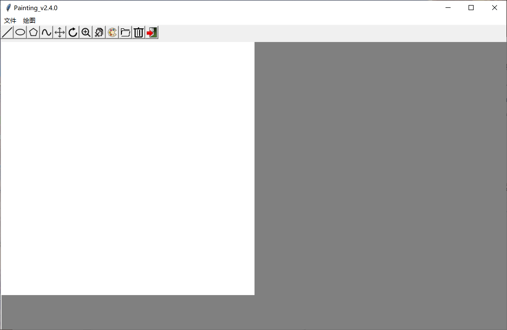

菜单栏中，“文件”下可以选择打开命令行文件、清除画布、保存和退出，“绘图”下可选择绘制直线、多边形、曲线以及裁剪的算法。如图。

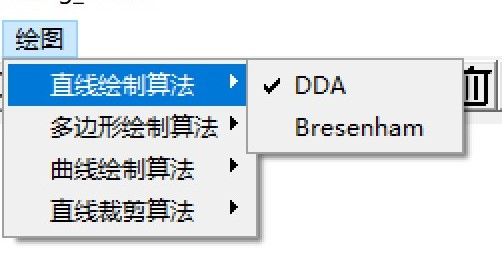

菜单栏下的一排图标分别为：绘制直线、椭圆、多边形、曲线、平移、旋转、缩放、线段裁剪、调色板、打开命令行文件、清空画布、退出程序。

下方为画布。白色部分为当前的画布，灰色部分为画布的最大大小。拖动白色画布边界就可以调整画布大小。

###### 2.2.2 图元绘制

若要绘制直线，点击绘制直线按钮，然后再画布上滑动即可绘制。在菜单栏中的“绘图”中，还可以选择绘制直线的算法（DDA或Bresenham）

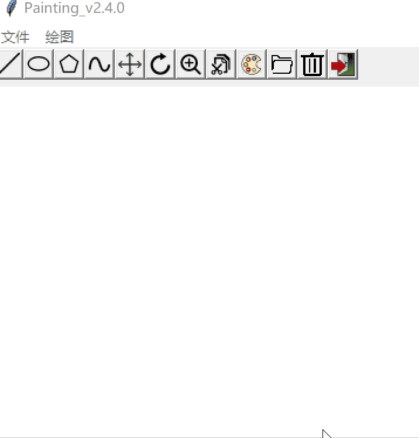

绘制椭圆时，点击椭圆按钮，然后拖动即可。得到的椭圆是点下鼠标的位置和松开鼠标的位置构成的矩形的内切椭圆。

绘制多边形时，点击多边形按钮。第一次点击画布时，决定第一个顶点，拖动后松开的位置是第二个顶点。此后，每次点按并拖动时，动态预览当前位置和上一个顶点之间的边，松开鼠标以决定顶点的位置。绘制完毕后，点击上方任意按钮结束，连接首尾顶点。

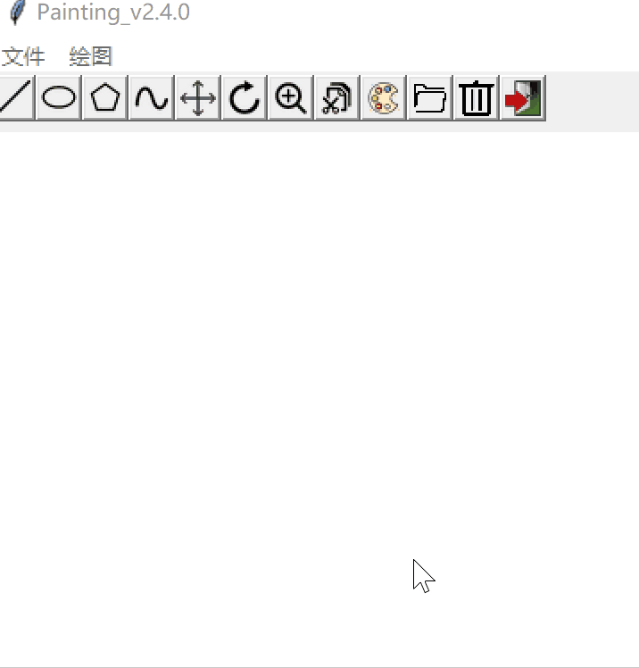

绘制曲线时，点击曲线按钮。绘制逻辑类似多边形，只是结束后不会封闭首末控制点。可以在菜单栏中的“绘图”中选择曲线算法（Bezier或B样条）。

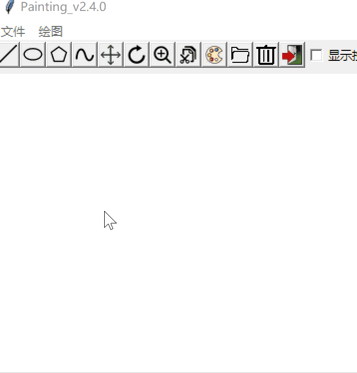
特殊地，在绘制椭圆时以及图元变换时，按钮右侧会出现“显示控制点”勾选框。勾选上则会显示控制点。仅当绘制椭圆时，拖动控制点可以调整任何一条曲线的形状。需要注意的是，修改正在绘制的曲线的控制点会导致此曲线停止绘制。

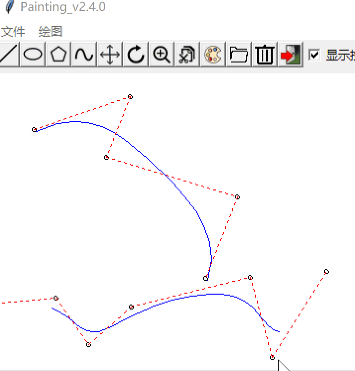

###### 2.2.3 图元变换

进行平移时，选择平移按钮，然后在按住任意图元拖动即可。若鼠标点击位置是多个图元的交点，则不进行平移。

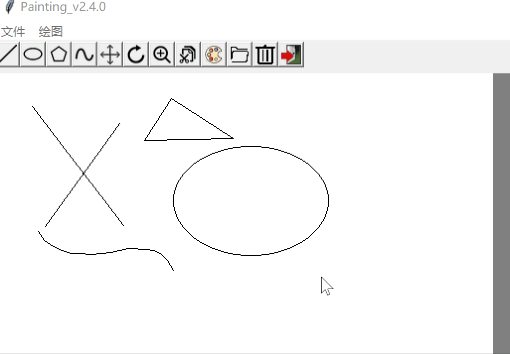

进行旋转时，点击旋转按钮，然后点击一个位置作为旋转中心，然后再拖动任意图元来旋转。

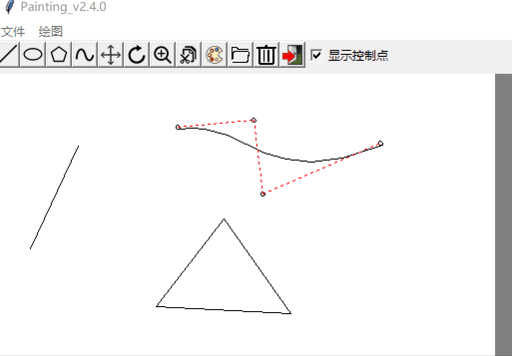

缩放时，点击缩放按钮。逻辑与旋转同理。

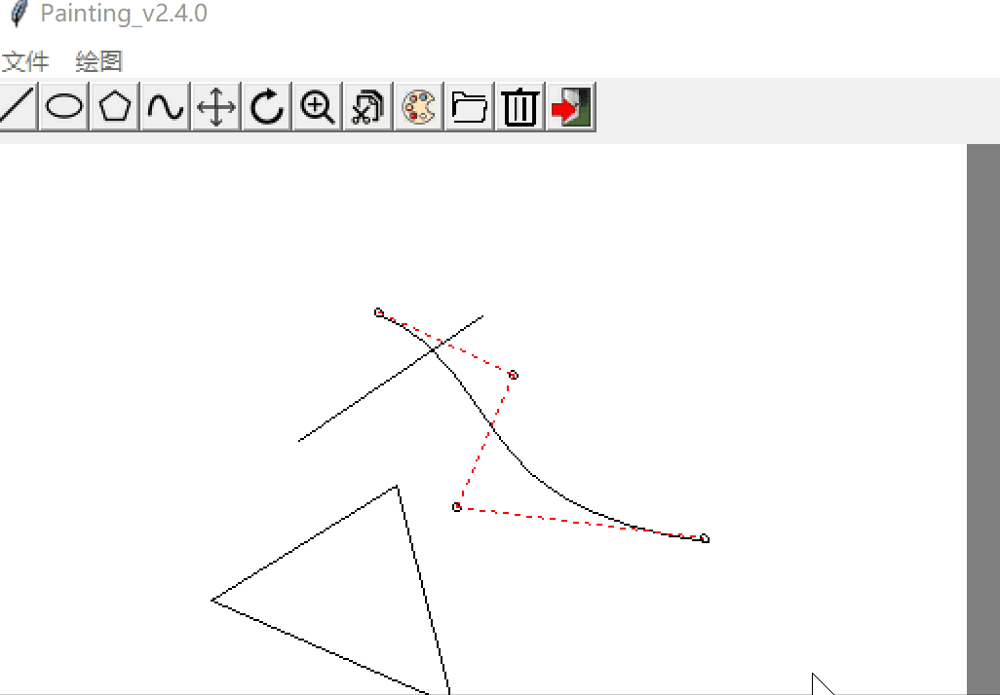

进行线段的裁剪时，点击裁剪按钮，然后点击选择一条线段。若选择成功，线段两侧会有标识，然后使用鼠标拖动裁剪框，拖动过程中，裁剪的结果会实时预览。

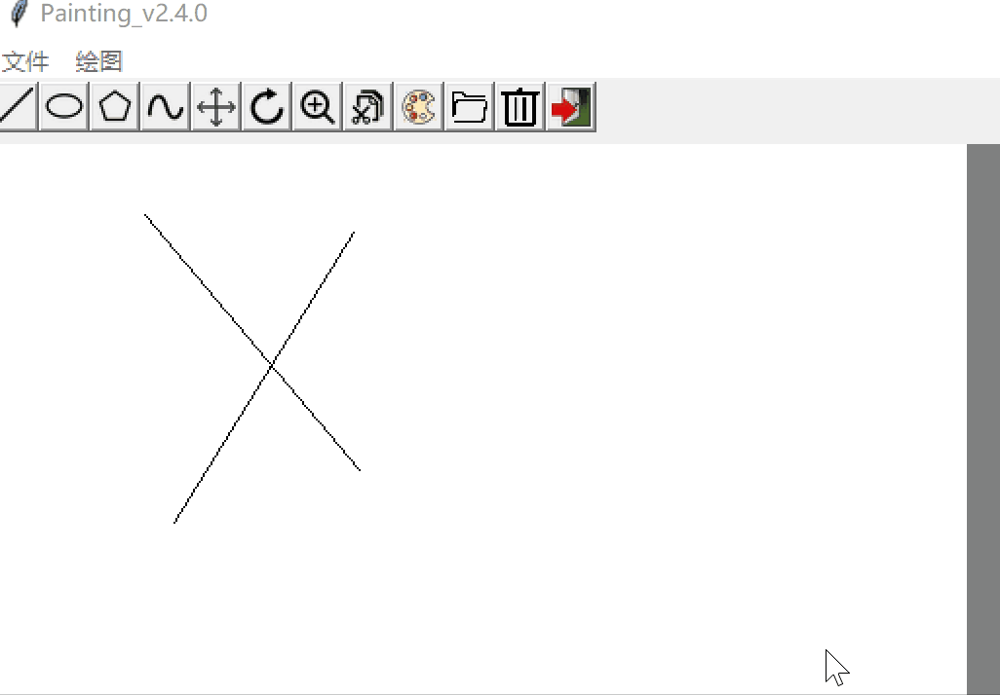

###### 2.2.4 其他功能

调色板可以选择颜色。

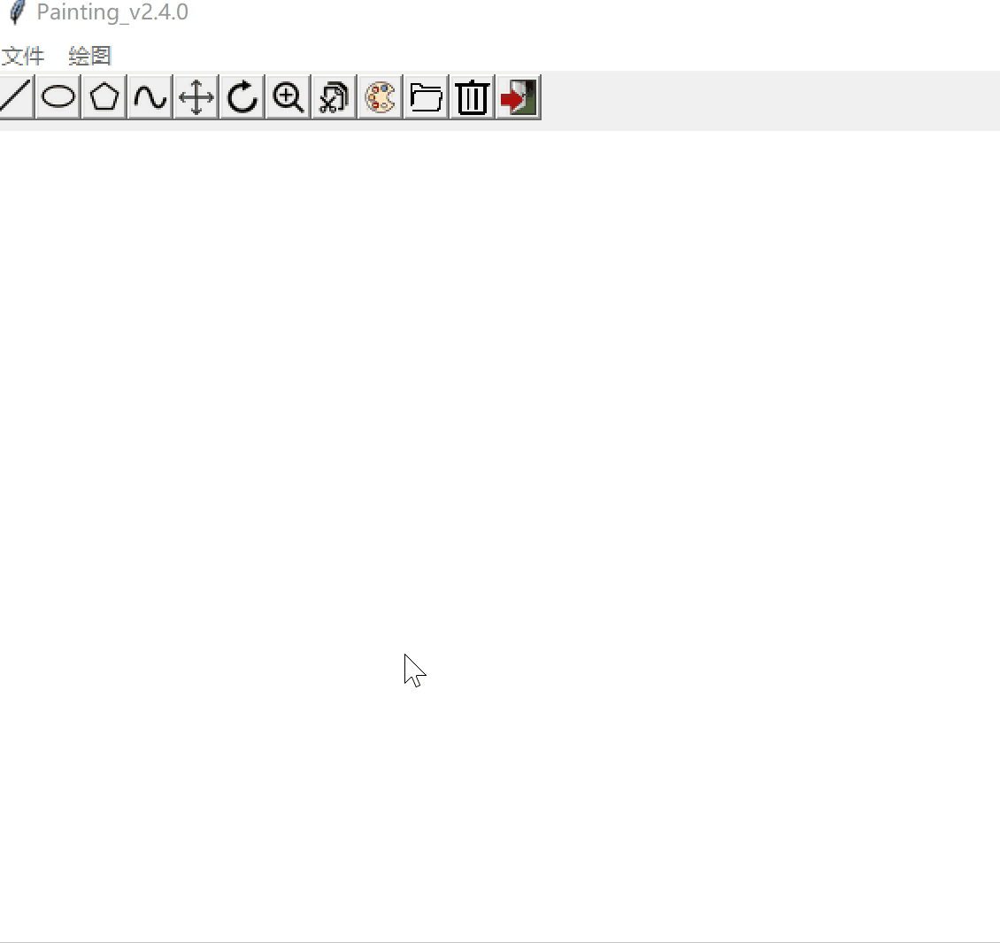

打开文件可以输入命令行文件。若输入为空，则默认打开同目录的input.txt，输出到同目录下。

清空画布时，点击清空图标即可。

画布的大小可以在任何时间调整。拖动边缘即可。需要注意的是，拖动画布边缘会导致多边形、曲线绘制的停止、旋转和缩放中心的重置。

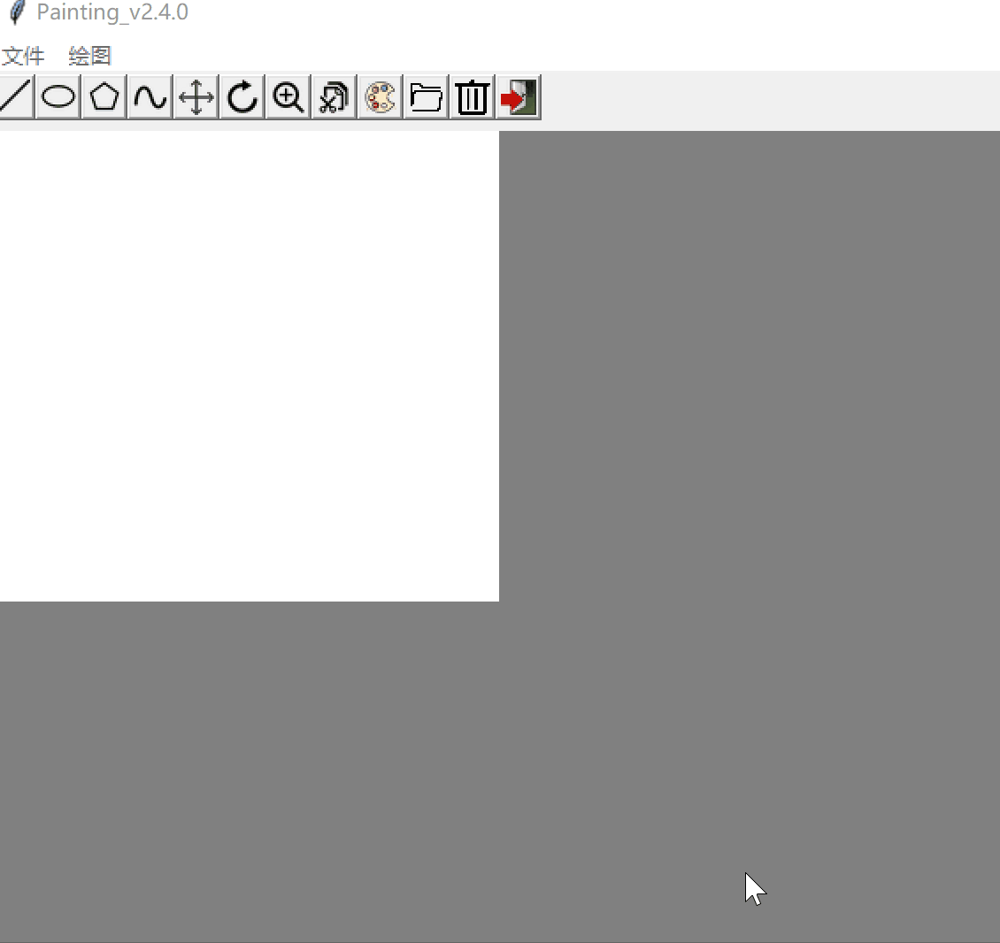

